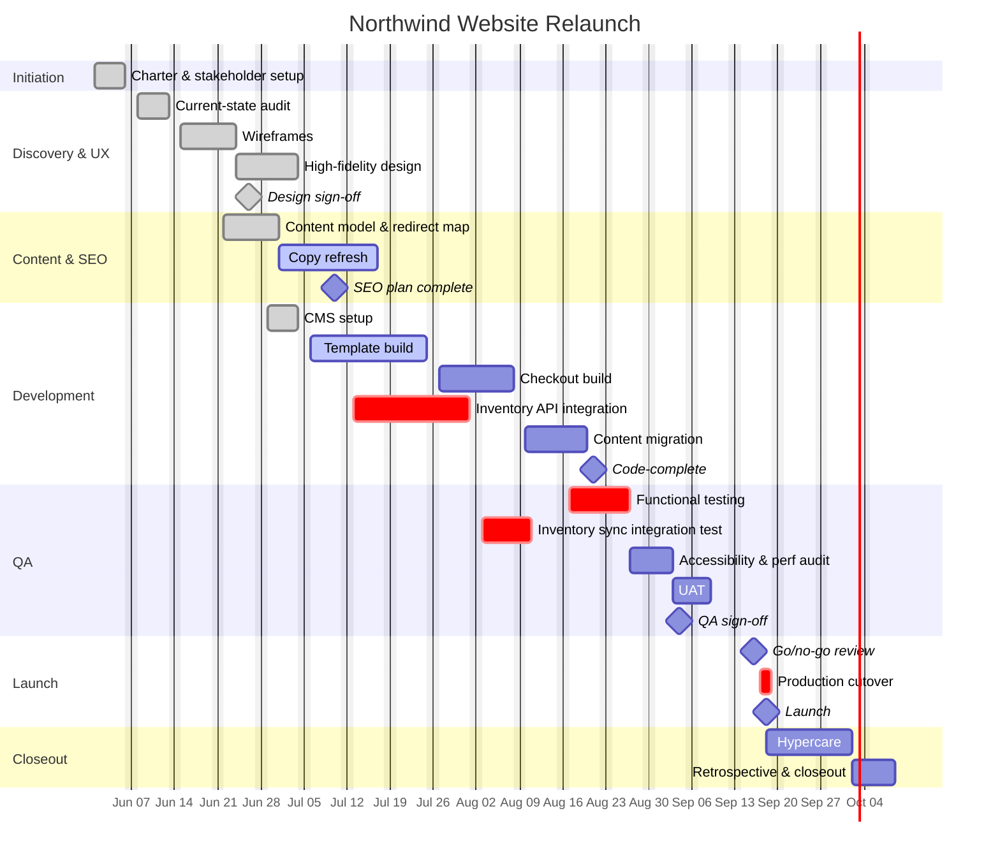

# Schedule — Northwind Website Relaunch

16 weeks, June 1 – September 18, 2026. Phases overlap deliberately (e.g., content work starts while design is still finishing) to protect the fixed launch date.

## Critical path

**Inventory API integration → inventory sync integration testing → QA sign-off → go/no-go → cutover.**

This chain has the least slack in the schedule — it's the one workstream that, if delayed, delays launch directly. It's why the [risk register](05-risk-register.md) weights inventory-API risks highest and why 5.2 (integration testing) got its own dedicated week instead of being folded into general QA.

## Buffer

Launch is set for Sep 18, six weeks ahead of the Nov 1 BFCM code-freeze — built in specifically to absorb slippage on the critical path without threatening the hard deadline.
